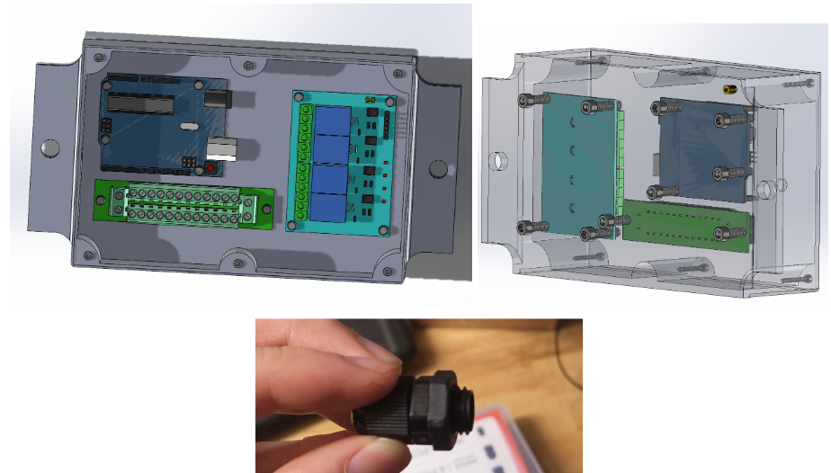

## UBC Agrobot Engineering Design Team
UBC Agrobot is an engineering student design team that competes in the International Field Robot Event (FRE) competition. With the emphasis on sustainability, our team develops an autonomous robot utilizing AI and machine learning for precise intra-row weeding and data collection. It identifies and eliminates weeds without harming crops, reducing the need for chemical pesticides. Additionally, the robot collects data on crop health to help farmers make better, more informed decisions.

### Agrobot’s full autonomous robot

  

## Extermination Subteam
I’ve worked as a mechanical engineer in the Extermination subteam. My subteam is essentially responsible for mechatronics work as we implement the electrical and mechanical design alongside programming. Some of the noticeable components we have been working on are: robotic arms, herbicide sprayers, and control algorithms based on real-time sensor data. Our efforts are crucial in enhancing AgroBot's weed management capabilities, improving crop yields, and reducing labor and chemical usage.

### components created by Extermination subteam

  

## Robot Arm Project

I’ve been mainly responsible for the robotic arm project that is specifically customized to our needs in farming. Our new robotic arm must hold a camera for gathering the real-time data and be integrated with the pump for the herbicide sprayer. The project members and I have had many meetings since the beginning of this project in October 2024. After defining the problems of the previous design and brainstorming, we made several versions of CAD models using SolidWorks. In December 2024, we finalized the design, and 3D-printed our first physical prototype.

### Brainstorming 1

  

 

### Brainstorming 2

  

 

Each project member worked on a separate component and assembled the whole thing at the end of every week. I worked on the bottom support of the arm. There was an issue with aligning with holes, and we realized we did not need that many holes to assemble pieces together.

### 1st CAD model

  

 

We changed the shape of the robotic arm from round to rectangular to increase structural stability. More discussion about the dimension was required for this.

### 2nd CAD model

  

 

Dimensions are pretty set at this stage. We ensured the location of each hole was accurate.

### 3rd CAD model

  

 

### final CAD model

  

 

### 1st 3D-printed prototype

  

## Side Project
This is my side project – electronics housing. I learned how to effectively put components together taking the wiring system into consideration. Regarding the fact that our robot is made to deal with the water system, I had to develop an electronics housing with a water-proof feature to some extent, and the solution I found was utilizing cable glands.

### electronics box (housing) and cable glands

  

## Current Responsibilities

As of the first half of 2025, My major ongoing task is early design cycle work for laser weeding. I am responsible for researching laser weeding strategies, outlining requirements, and sketching/submitting concepts for team-wide design review. While actively engaging with my duties, I look forward to strengthening the following skills: researching, good documentation practices, engineering sketches, mechanical design, concept pitching & presenting. 
